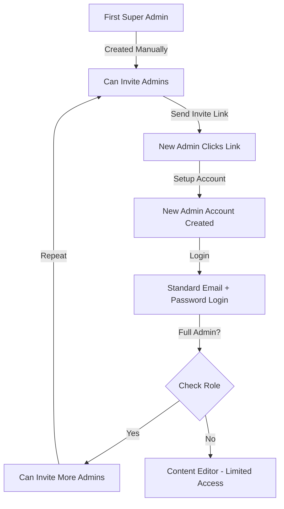

# 🔐 Authentication System Documentation

Based on your Figma design, this is a complete invite-based admin authentication system.

---

## 📋 Overview

This system implements the **exact flow** from your Figma design:

1. **Invite-based setup** for first-time admins
2. **Standard login** for existing admins
3. **Forgot password** with email recovery
4. **Role-based access** (Full Admin vs Content Editor)
5. **Admin invite system** (Full Admins can invite others)

---

## 🎯 Authentication Flow

### Flow 1: First-Time Login (via Invite)

```
1. Admin receives invite link via email
   ↓
2. Clicks link → /login?token=ABC123
   ↓
3. Redirected to /auth/setup
   ↓
4. Sees:
   - Email (pre-filled from invite)
   - Full Name field
   - Password field (with rules)
   - Confirm Password
   - Role badge (Full Admin or Content Editor)
   ↓
5. Submits form → Account created
   ↓
6. Redirected to /login
   ↓
7. Logs in with email + password
   ↓
8. Access to Admin Panel
```

### Flow 2: Standard Login

```
1. Goes to /login
   ↓
2. Enters email + password
   ↓
3. Clicks "Log In"
   ↓
4. System validates:
   - User exists in auth
   - User has is_admin = true
   - User record exists
   ↓
5. If valid → Redirect to /admin
   If invalid → Show error
```

### Flow 3: Forgot Password

```
1. Clicks "Forgot Password?" on login page
   ↓
2. Goes to /auth/forgot-password
   ↓
3. Enters email
   ↓
4. Clicks "Continue"
   ↓
5. Confirmation screen: "Check Your Email"
   ↓
6. User clicks link in email
   ↓
7. Goes to /auth/reset-password
   ↓
8. Enters new password + confirm
   ↓
9. Clicks "Reset Password & Log In"
   ↓
10. Redirected to /login
```

---

## 👥 Admin Roles

### Full Admin
**Permissions:**
- ✅ Manage packs, samples, creators
- ✅ Manage users and admins
- ✅ See billing and adjust credits
- ✅ Manage subscription plans
- ✅ **Invite new admins**

**Badge Color:** Red

### Content Editor
**Permissions:**
- ✅ Manage packs, samples, creators
- ✅ Manage permissions
- ❌ Cannot see billing
- ❌ Cannot adjust credits
- ❌ Cannot manage plans
- ❌ **Cannot invite admins**

**Badge Color:** Blue

---

## 🚀 How to Use

### Step 1: Create First Super Admin (Manual)

Since this is invite-based, the **very first admin** must be created manually:

```bash
# 1. Run database migrations
npx supabase db push

# 2. Create user in Supabase Auth UI
# Go to: Authentication > Users > Add user

# 3. Insert into users table (replace UUID and email)
```

```sql
INSERT INTO users (id, email, name, is_admin, role)
VALUES (
  'YOUR_AUTH_UUID',
  'admin@samplelab.com',
  'Super Admin',
  true,
  'full_admin'
);
```

### Step 2: Login as Super Admin

1. Go to: http://localhost:3000/login
2. Enter email and password
3. Access admin panel

### Step 3: Invite Other Admins

1. In admin panel, go to: **Users** → **Invite Admin**
2. Enter new admin's email
3. Select role:
   - **Full Admin** - All permissions
   - **Content Editor** - Limited permissions
4. Click **"Send Invitation"**
5. Copy the invite link
6. Send link to new admin (email, Slack, etc.)

### Step 4: New Admin Setup

1. New admin clicks invite link
2. Redirected to setup page
3. Enters:
   - Full name
   - Password (with validation)
   - Confirm password
4. Account created automatically
5. Redirected to login
6. Can now log in with email + password

---

## 📁 File Structure

### Authentication Pages
```
app/
├── login/
│   └── page.tsx                 # Standard login
├── auth/
│   ├── setup/
│   │   └── page.tsx             # First-time admin setup (invite)
│   ├── forgot-password/
│   │   └── page.tsx             # Forgot password request
│   └── reset-password/
│       └── page.tsx             # Reset password form
```

### Admin Pages
```
app/admin/
└── users/
    ├── page.tsx                 # List all admin users
    └── invite/
        └── page.tsx             # Invite new admin
```

### API Routes
```
app/api/
├── auth/
│   ├── validate-invite/
│   │   └── route.ts             # Validate invite token
│   ├── setup-admin/
│   │   └── route.ts             # Create admin account
│   └── forgot-password/
│       └── route.ts             # Send password reset email
└── admin/
    └── invite/
        └── route.ts             # Create/list invitations
```

### Database Migrations
```
supabase/migrations/
├── 20260204000001_initial_setup.sql
└── 20260204000002_add_admin_invites.sql
```

---

## 🗄️ Database Schema

### Users Table
```sql
CREATE TABLE users (
  id UUID PRIMARY KEY,
  email TEXT NOT NULL UNIQUE,
  name TEXT,
  is_admin BOOLEAN DEFAULT FALSE,
  role TEXT DEFAULT 'content_editor',  -- 'full_admin' or 'content_editor'
  created_at TIMESTAMP,
  updated_at TIMESTAMP
);
```

### Admin Invites Table
```sql
CREATE TABLE admin_invites (
  id UUID PRIMARY KEY,
  email TEXT NOT NULL,
  role TEXT NOT NULL,                  -- 'full_admin' or 'content_editor'
  invited_by UUID REFERENCES users(id),
  token TEXT NOT NULL UNIQUE,
  expires_at TIMESTAMP NOT NULL,       -- Expires in 7 days
  used BOOLEAN DEFAULT FALSE,
  created_at TIMESTAMP
);
```

---

## 🔒 Security Features

### Password Requirements
- ✅ Minimum 8 characters
- ✅ At least one uppercase letter
- ✅ At least one lowercase letter
- ✅ At least one number

### Invite Security
- ✅ Unique token (32-byte hex)
- ✅ Expires in 7 days
- ✅ Single-use only (marked as used after setup)
- ✅ Only Full Admins can create invites

### Role-Based Access
- ✅ `is_admin` check on all admin routes
- ✅ `role` check for invite functionality
- ✅ RLS policies on database tables

---

## 🧪 Testing the System

### Test 1: First Admin Setup

```bash
# 1. Create first admin manually (see Step 1 above)
# 2. Go to: http://localhost:3000/login
# 3. Login with credentials
# 4. Should see admin panel
```

### Test 2: Invite Flow

```bash
# 1. Login as Full Admin
# 2. Go to: /admin/users
# 3. Click "Invite Admin"
# 4. Enter email and select role
# 5. Copy invite link
# 6. Open link in incognito window
# 7. Should see setup page with email pre-filled
# 8. Complete setup
# 9. Should be redirected to login
# 10. Login with new credentials
```

### Test 3: Forgot Password

```bash
# 1. Go to: /login
# 2. Click "Forgot Password?"
# 3. Enter email
# 4. Check email for reset link
# 5. Click link → Should go to reset password page
# 6. Enter new password
# 7. Submit → Should redirect to login
# 8. Login with new password
```

---

## ⚙️ Configuration

### Environment Variables

```env
NEXT_PUBLIC_SUPABASE_URL=your_supabase_url
NEXT_PUBLIC_SUPABASE_ANON_KEY=your_anon_key
SUPABASE_SERVICE_ROLE_KEY=your_service_role_key
NEXT_PUBLIC_APP_URL=http://localhost:3000
```

### Supabase Auth Settings

In your Supabase dashboard:

1. **Authentication > URL Configuration**
   - Site URL: `http://localhost:3000`
   - Redirect URLs: `http://localhost:3000/auth/reset-password`

2. **Authentication > Email Templates**
   - Customize reset password email template
   - Add your branding

---

## 🎨 UI Components (from Figma)

### Colors Used
- **Primary (Purple)**: `#9333EA` (purple-600)
- **Success (Green)**: `#10B981` (green-500)
- **Error (Red)**: `#EF4444` (red-500)
- **Full Admin Badge**: Red background
- **Content Editor Badge**: Blue background

### Gradients
- Login background: `purple-50` to `blue-50`

### Button States
- **Primary Button**: Purple background, white text
- **Secondary Button**: Gray background
- **Disabled**: Gray with cursor-not-allowed

---

## 🐛 Troubleshooting

### Issue: "Invalid invitation" error
**Solution**: 
- Check if token is in URL
- Check if invite is not used
- Check if invite hasn't expired

### Issue: Cannot create admin account
**Solution**:
- Check password meets requirements
- Check email doesn't already exist
- Check invite token is valid

### Issue: "Access denied" after login
**Solution**:
- Check `is_admin = true` in users table
- Check user record exists
- Check Supabase Auth user exists

---

## 📊 Admin Logic Flow



---

## ✅ Checklist for Go-Live

- [ ] Database migrations applied
- [ ] First super admin created manually
- [ ] Environment variables configured
- [ ] Supabase auth URLs configured
- [ ] Email templates customized
- [ ] Tested invite flow end-to-end
- [ ] Tested forgot password flow
- [ ] Tested role permissions
- [ ] SSL certificate (for production)
- [ ] Custom domain configured

---

## 🎯 Summary

Your auth system now implements the **exact flow from your Figma design**:

1. ✅ Invite-based admin setup
2. ✅ Standard email/password login
3. ✅ Forgot password flow
4. ✅ Two admin roles (Full Admin & Content Editor)
5. ✅ Admin invite system
6. ✅ Password validation rules
7. ✅ Secure token-based invites
8. ✅ Role-based permissions

**Next Steps:**
1. Run migrations: `npx supabase db push`
2. Create first super admin (manual SQL)
3. Test the complete flow
4. Customize email templates in Supabase

---

**Ready to use! 🚀**
